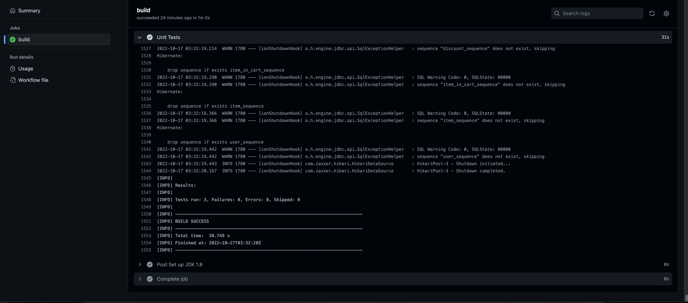

# Shopping List Web App

Visit the website here! [https://nathanraymant.com/Emporium/index.html](https://nathanraymant.com/Emporium/index.html)

This project contains a frontend and backend folder. You can find the options we discussed before choosing
a technology [here](/TechnologyOptionsReport.pdf).

We setup our test infrastructure to run Unit tests as well. We currently have 2 functional
Unit Tests that test logic. For the backend we used JUnit as well as Spring to help inject dependencies
to test our 3 layers, the Repository layer, Service layer, and Controller layer. In
the frontend, we planned to use Jest to unit test small functionalities of the pages.

In order to run the functional unit tests in the backend, you need maven installed as well as
Java 17. You can run tests by going into the `backend` directory and running `mvn test`.
If you do not have the languages setup, here are some screenshots proving our tests run!

Here are the tests running in IntelliJ:

And here is the GitHub actions workflow running the tests:

GitHub actions is set to automatically run the tests each time some commits are pushed
to the repository. This means they will run without us needing to do anything.
Our backend is also deployed through heroku where the API Docs are available at
[https://shoppinglist301.herokuapp.com/api/docs](https://shoppinglist301.herokuapp.com/api/docs).
These also deploy automatically upon push from git.